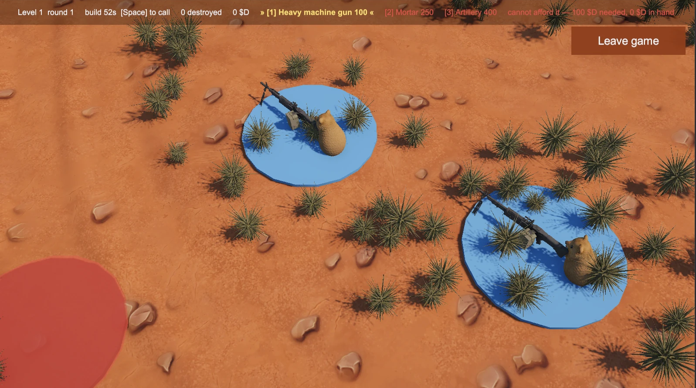
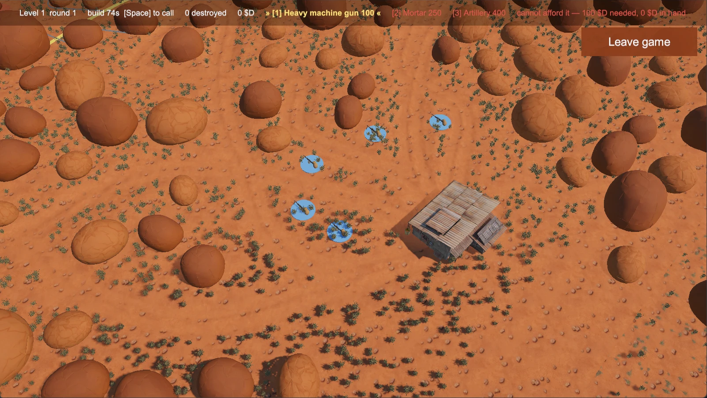
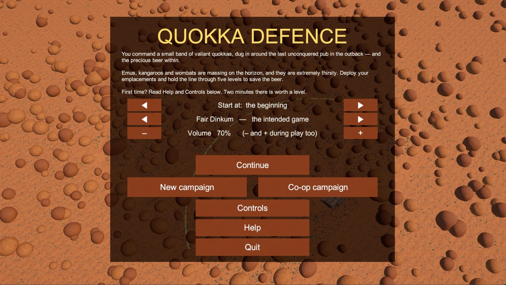
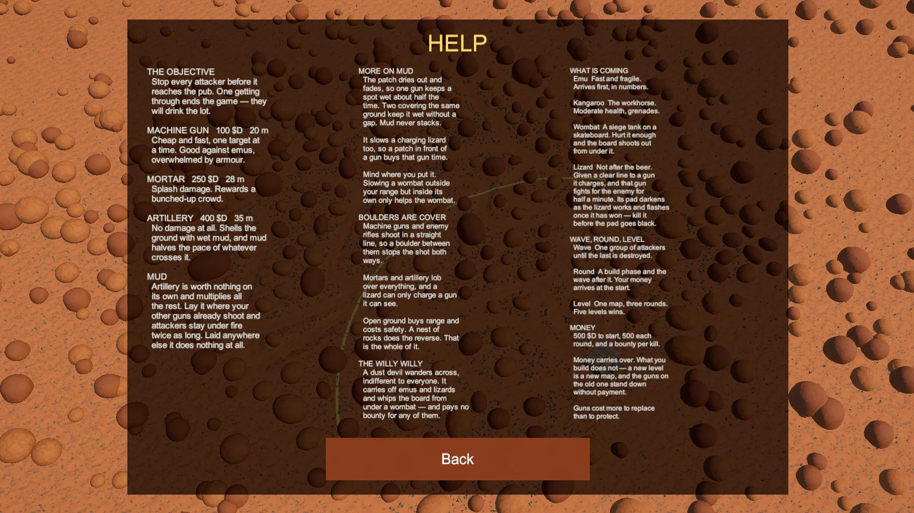

# Quokka Defence

**A comic tower defence game set in the Australian outback.** Quokkas hold a pub
against emus, kangaroos, wombats on skateboards, and a frilled-neck lizard that
will turn your own guns against you.

Made by [Wombyland](https://www.wombyland.com/). Windows, single player or
two-player co-op.

---

## Download

**[⬇ Get the latest release](../../releases/latest)**

| | |
|---|---|
| **Installer** — `QuokkaDefence-2.1-Setup.exe` | Recommended. Installs for the current user only, so it needs no administrator rights. Adds a Start menu entry and an optional desktop shortcut. |
| **Portable zip** — `QuokkaDefence-2.1-Windows.zip` | No installation. Unzip anywhere and run `Quokka Defence.exe`. |

### Windows will warn you about this download

Quokka Defence is not code-signed — certificates cost several hundred dollars a
year, which is difficult to justify for a free game. Windows SmartScreen will
therefore show **"Windows protected your PC"** when you run the installer.

To continue: click **More info**, then **Run anyway**.

This warning means Microsoft has not seen the file often enough to have formed an
opinion of it. It is not a virus report. If you would rather verify the file
yourself, every release lists a SHA-256 checksum you can compare against
`Get-FileHash` in PowerShell.

**If Windows refuses outright, with no "Run anyway" option**, you have Smart App
Control switched on. That is a stricter protection than SmartScreen, on by
default on some new Windows 11 machines, and it blocks unsigned software rather
than warning about it. There is no per-application exception — the only ways
round it are to turn Smart App Control off in **Windows Security → App & browser
control** (which cannot be switched back on without reinstalling Windows), or to
use the portable zip instead, which sometimes passes where the installer does
not.

Neither is a small ask, and you are entitled to decline. Signing is on the list.

---

## Requirements

| | |
|---|---|
| **Operating system** | Windows 10 or 11, 64-bit |
| **Graphics** | DirectX 12, falling back to DirectX 11 |
| **Disk space** | Roughly 250 MB installed |

The game opens in a 1600 × 900 window.

---

## How it plays

The map is a square with the pub against one edge. Attackers enter from the
opposite edge and every path converges on the pub. Stop them before they reach it.

A **round** is a two-minute build phase followed by the wave it pays for. Three
rounds make a **level**, and completing a level generates a new map. The campaign
runs to five levels.

**Four difficulties**, and they mean what they say:

| | |
|---|---|
| **Picnic** | a gentle stroll — for learning the ropes |
| **Fair Dinkum** | the intended game |
| **Hard Yakka** | for those who have held the line before |
| **Drop Bear** | you have been warned — unlocks when you finish a campaign |

Hard Yakka is tuned so that the final round defeats an experienced player more
often than not. Finishing on that setting is a result, not a formality.

**Drop Bear has never been beaten**, including by the person who made it — it is
deliberately tuned beyond her. It is meant to be possible for a player with
better reflexes than that. Whether it actually is remains an open question.

**The three guns do different jobs.** The heavy machine gun is cheap anti-swarm
and gets overwhelmed by armour. The mortar is your area damage. Artillery does
**no damage at all** — it shells the ground with cluster mud that halves the pace
of anything crossing it, which is worth nothing on its own and multiplies
everything else.

**Watch for the lizard.** It ignores the pub entirely. Given a clear line to one
of your emplacements it charges at two and a half times normal speed and turns
that gun against you for thirty seconds. It is the priority target.

---

## The game explains itself

There is a Help screen and a Controls screen on the main menu, and both are
available during play. Two minutes there is worth a level.

---

## Controls

**Camera**

| Action | Control |
|---|---|
| Pan | `W` `A` `S` `D` or arrow keys, or drag with the middle mouse button |
| Orbit | Drag left/right with the right mouse button, or `Q` and `E` |
| Tilt, overhead down to ground level | Drag up/down with the right mouse button, or `R` and `F` |
| Zoom | Mouse wheel |
| Frame the whole map | `F` |

**Building**

| Action | Control |
|---|---|
| Choose machine gun, mortar, artillery | `1` `2` `3` |
| Place it | Left click on valid ground |
| Inspect an emplacement | Left click it with nothing selected |
| Sell the inspected emplacement | `X` |
| Upgrade the inspected emplacement | `U` |
| Change targeting priority | `T` |
| Cancel | `Esc` |

**Everything else**

| Action | Control |
|---|---|
| Call the next wave early | `Space` |
| Pause | `P` — also automatic when the window loses focus |
| Volume | `-` and `+`, at any time, including mid-wave |
| Interface detail | `H` cycles full, one line, none |

The placement preview shows the weapon's range as a ring before you spend
anything, and turns red where the ground cannot be built on.

---

## Uninstalling

Installed with the installer: **Settings → Apps → Installed apps → Quokka
Defence → Uninstall**, or use the Start menu entry.

Used the portable zip: delete the folder.

Saved games and settings live in
`%UserProfile%\AppData\LocalLow\Wombyland\Quokka Defence` and are left alone by
the uninstaller. Delete that folder by hand if you want them gone.

---

## Reporting a problem

Open an [issue](../../issues). What helps most:

- What you were doing when it happened
- Your Windows version
- The log file from `%UserProfile%\AppData\LocalLow\Wombyland\Quokka Defence\Player.log`

---

## About

Quokka Defence is one of several games at
**[wombyland.com](https://www.wombyland.com/)**.

This repository distributes the game only. It contains no source code — see
[LICENSE.txt](LICENSE.txt) for terms.
